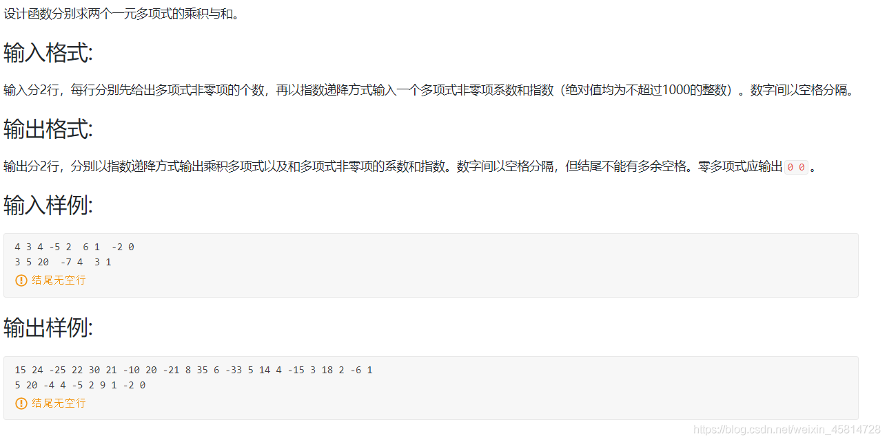
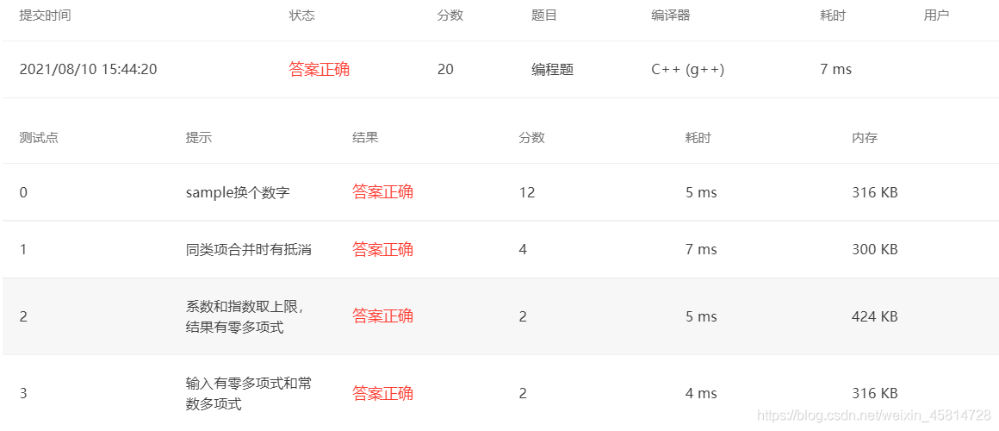

# 02-线性结构2 一元多项式的乘法与加法运算


<!--more-->


## 题目：



# version 1：
## 代码：

```cpp
#include <iostream>
using namespace std;
typedef struct Node* PNode;//多项式一个元素
//题目意思是指，每次输入一项的系数和指数，而不是先输完所有系数，再输指数。
struct Node 
{
    int coe;//系数
    int exp;//指数
    PNode next;
};
typedef PNode Poly;//多项式

Poly Read()
{
    Poly L = (Poly)malloc(sizeof(Node));
    
    PNode tail = L;//尾结点
    int n;
    cin >> n;//多项式非零项的个数
    for (int i = 0; i < n; i++)
    {
        int x; cin >> x;//系数
        int y; cin >> y;//指数
        PNode p = (PNode)malloc(sizeof(Node));
        p->coe = x;
        p->exp = y;
        tail->next = p;
        tail = p;
    }
    
    tail->next = NULL;
    return L;
}
void Print(Poly L)
{
    PNode p = L->next;
    if (p==NULL)cout << "0 0";
    while (p)
    {
        cout << p->coe << " ";
        if (p->next == NULL)cout << p->exp;
        else cout << p->exp << " ";
        p = p->next;
    }//打印系数和指数
    
    
}
Poly Add(Poly L1, Poly L2)
{
    PNode p1 = L1->next;
    PNode p2 = L2->next;
    Poly L = (Poly)malloc(sizeof(struct Node));
    PNode tail = L;
    while (p1 || p2)
    {
        if (p1&&p2&&p1->exp == p2->exp)
        {//指数相等，系数相加
            
            PNode p = (PNode)malloc(sizeof(struct Node));
            p->exp = p1->exp;
            p->coe = p1->coe + p2->coe;
            if (p->coe != 0)
            {
                p->next = NULL;
                tail->next = p;
                tail = p;
            }
            //若系数为0，则结果不加入多项式
            //p1,p2更新
            p1 = p1->next;
            p2 = p2->next;
            
        }
        //p2为空或p1>p2，插入p2
        else if (p1&&(p2==NULL)||(p1&&p2)&&(p1->exp > p2->exp))
        {//指数大的项加入结果多项式中
            PNode p = (PNode)malloc(sizeof(struct Node));
            p->exp = p1->exp;
            p->coe = p1->coe;
            p->next = NULL;
            tail->next = p;
            tail = p;
            p1 = p1->next;//更新p1
            
        }
        //p1为空，或p1<p2，插入p2的项
        else if((p1==NULL)&&p2||(p1&&p2)&&(p1->exp<p2->exp))
        {
            PNode p = (PNode)malloc(sizeof(struct Node));
            p->exp = p2->exp;
            p->coe = p2->coe;
            p->next = NULL;
            tail->next = p;
            tail = p;
            p2 = p2->next;//更新p2
        
        }
        tail->next = NULL;
    }
    return L;
}
Poly Multy(Poly L1, Poly L2)
{
    PNode p1 = L1->next;
    PNode p2 = L2->next;
    Poly L = (Poly)malloc(sizeof(struct Node));
    L->next = NULL;
    //PNode tail = L;
    while (p2)
    {
        while (p1)
        {//扫描p1
            PNode p = (PNode)malloc(sizeof(struct Node));
            p->coe = p1->coe * p2->coe;//系数相乘
            p->exp = p1->exp + p2->exp;//指数相加
            p->next = NULL;
            PNode q = L->next;
            if (q == NULL) 
            {
                L->next= p; p1 = p1->next; continue;
            }//结果多项式为空，直接插入 
            while (q)
                {//扫描结果多项式
                    if (q->exp == p->exp)//若有指数相同，则将系数相加
                    {
                        q->coe = q->coe + p->coe; break;
                    }
                    if (q->next == NULL)//若无指数相同项，将其插入合适的位置
                    {
                        q->next = p; break;
                    }
                    if ((q->next != NULL) && (q->next->exp < p->exp))
                    {
                        p->next = q->next;
                        q->next = p;
                    }

                    q = q->next;
                }
            p1 = p1->next;
            }
        p2 = p2->next;
        p1 = L1->next;
        }
        return L;
    }

int main()
{
    Poly L3,L4,L1,L2;
    L1 = Read();
    L2 = Read();
    L3 = Multy(L1, L2);
    L4 = Add(L1, L2);
    Print(L3); cout << endl;
    Print(L4);

    return 0;
}
```
## 结果

## version 2
经过一番分析，问题出在乘法的部分，当有同类项相加为0的情况处理不正确。如下：
### 错误代码：

```cpp
//扫描结果多项式
if (q->exp == p->exp)//若有指数相同，则将系数相加
{
    q->coe = q->coe + p->coe; break;
}
```

### 正确代码：

```cpp
//扫描结果多项式
if (q->exp == p->exp)//若有指数相同，则将系数相加
{
    
    q->coe = q->coe + p->coe;
    if (q->coe == 0)
    {//若系数相加为0，应删除此项
        PNode temp = L->next;
        while (temp->next != q)temp = temp->next;//找出q的前驱结点
        temp->next = q->next;

    }; break;
}
```
### 完整代码：

```cpp
#include <iostream>
using namespace std;
typedef struct Node* PNode;//多项式一个元素
//题目意思是指，每次输入一项的系数和指数，而不是先输完所有系数，再输指数。
struct Node 
{
    int coe;//系数
    int exp;//指数
    PNode next;
};
typedef PNode Poly;//多项式

Poly Read()
{
    Poly L = (Poly)malloc(sizeof(Node));
    
    PNode tail = L;//尾结点
    int n;
    cin >> n;//多项式非零项的个数
    for (int i = 0; i < n; i++)
    {
        int x; cin >> x;//系数
        int y; cin >> y;//指数
        PNode p = (PNode)malloc(sizeof(Node));
        p->coe = x;
        p->exp = y;
        tail->next = p;
        tail = p;
    }
    
    tail->next = NULL;
    return L;
}
void Print(Poly L)
{
    PNode p = L->next;
    if (p==NULL)cout << "0 0";
    while (p)
    {
        cout << p->coe << " ";
        if (p->next == NULL)cout << p->exp;
        else cout << p->exp << " ";
        p = p->next;
    }//打印系数和指数
    
    
}
Poly Add(Poly L1, Poly L2)
{
    PNode p1 = L1->next;
    PNode p2 = L2->next;
    Poly L = (Poly)malloc(sizeof(struct Node));
    PNode tail = L;
    while (p1 || p2)
    {
        if (p1&&p2&&p1->exp == p2->exp)
        {//指数相等，系数相加
            
            PNode p = (PNode)malloc(sizeof(struct Node));
            p->exp = p1->exp;
            p->coe = p1->coe + p2->coe;
            if (p->coe != 0)
            {
                p->next = NULL;
                tail->next = p;
                tail = p;
            }
            //若系数为0，则结果不加入多项式
            //p1,p2更新
            p1 = p1->next;
            p2 = p2->next;
            
        }
        //p2为空或p1>p2，插入p2
        else if (p1&&(p2==NULL)||(p1&&p2)&&(p1->exp > p2->exp))
        {//指数大的项加入结果多项式中
            PNode p = (PNode)malloc(sizeof(struct Node));
            p->exp = p1->exp;
            p->coe = p1->coe;
            p->next = NULL;
            tail->next = p;
            tail = p;
            p1 = p1->next;//更新p1
            
        }
        //p1为空，或p1<p2，插入p2的项
        else if((p1==NULL)&&p2||(p1&&p2)&&(p1->exp<p2->exp))
        {
            PNode p = (PNode)malloc(sizeof(struct Node));
            p->exp = p2->exp;
            p->coe = p2->coe;
            p->next = NULL;
            tail->next = p;
            tail = p;
            p2 = p2->next;//更新p2
        
        }
        tail->next = NULL;
    }
    return L;
}
Poly Multy(Poly L1, Poly L2)
{
    PNode p1 = L1->next;
    PNode p2 = L2->next;
    Poly L = (Poly)malloc(sizeof(struct Node));
    L->next = NULL;
    //PNode tail = L;
    while (p2)
    {
        while (p1)
        {//扫描p1
            PNode p = (PNode)malloc(sizeof(struct Node));
            p->coe = p1->coe * p2->coe;//系数相乘
            p->exp = p1->exp + p2->exp;//指数相加
            p->next = NULL;
            PNode q = L->next;
            if (q == NULL) 
            {
                L->next= p; p1 = p1->next; continue;
            }//结果多项式为空，直接插入 
            while (q)
                {//扫描结果多项式
                    if (q->exp == p->exp)//若有指数相同，则将系数相加
                    {
                        
                        q->coe = q->coe + p->coe;
                        if (q->coe == 0)
                        {
                            PNode temp = L->next;
                            while (temp->next != q)temp = temp->next;//找出q的前驱结点
                            temp->next = q->next;

                        }; break;
                    }
                    if (q->next == NULL)//若无指数相同项，将其插入合适的位置
                    {
                        q->next = p; break;
                    }
                    if ((q->next != NULL) && (q->next->exp < p->exp))
                    {
                        p->next = q->next;
                        q->next = p;
                    }

                    q = q->next;
                }
            p1 = p1->next;
            }
        p2 = p2->next;
        p1 = L1->next;
        }
        return L;
    }

int main()
{
    Poly L3,L4,L1,L2;
    L1 = Read();
    L2 = Read();
    L3 = Multy(L1, L2);
    L4 = Add(L1, L2);
    Print(L3); cout << endl;
    Print(L4);

    return 0;
}
```

更改后结果：

## 总结：
1.对题意的理解一开始出错，导致绕了一些弯。
2.同类型抵消的情况一开始只考虑了加法，实际上乘法也需要考虑。
3.格式化输出方面也需要认真读题，比如此题要求每一行输出后无多余空格。
4.改进空间：用了较多的if-else语句，可能增加了耗时。

